# 2026-07-02 Task0 success-like filtered SFT report

## Scope

This report compares LIBERO task0 (`libero_90_0`) policies trained from three preloaded success-like datasets against the pretrained/no-SFT reference policy. Training used only the exported dataset episodes; no new online collection was added during SFT.

The policy metric is:

```text
policy_success_rate = successful simulator eval episodes / 100 eval episodes
```

Dataset success/failure counts are separate from policy rollout success rates. Dataset counts are the actual simulator labels of the episodes used for SFT.

## Quick readout

- All requested variants completed the 100-rollout evaluation.
- Pretrained/no-SFT reference: 12/100 successes (12.0%).
- `random_val150_full` SFT: 15/100 successes (15.0%), +3.0 pp vs pretrained.
- `reward_top150_pred_success` SFT: 23/100 successes (23.0%), +11.0 pp vs pretrained.
- `reward_std_top150_pred_success` SFT: 43/100 successes (43.0%), +31.0 pp vs pretrained and best among these runs.
- Rollout GIFs are included for 3 episodes per policy/reference.

## Dataset composition

| dataset | episodes | actual successes | actual failures | dataset success rate | TP | FP |
|---|---:|---:|---:|---:|---:|---:|
| `random_val150_full` | 150 | 10 | 140 | 6.7% |  |  |
| `reward_top150_pred_success` | 25 | 6 | 19 | 24.0% | 6 | 19 |
| `reward_std_top150_pred_success` | 8 | 5 | 3 | 62.5% | 5 | 3 |

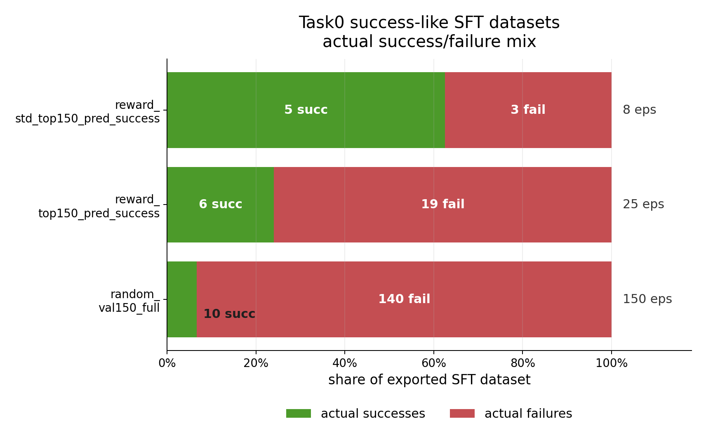

The reward+std filter produced the smallest but cleanest SFT dataset: 5 successes and 3 failures out of 8 episodes. The reward-only predicted-success subset retained more episodes but still included 19 failures out of 25 selected rows. The random validation subset is mostly failures for task0.

## Policy evaluation

| policy | kind | checkpoint step | eval rollouts | successes | failures | success rate | Δ vs pretrained | mean successful episode length |
|---|---|---:|---:|---:|---:|---:|---:|---:|
| `pretrained_reference` | pretrained/no-SFT reference | 0 | 100 | 12 | 88 | 12.0% | — | 256.75 |
| `random_val150_full` | SFT | 4000 | 100 | 15 | 85 | 15.0% | +3.0 pp | 278.67 |
| `reward_top150_pred_success` | SFT | 4000 | 100 | 23 | 77 | 23.0% | +11.0 pp | 182.91 |
| `reward_std_top150_pred_success` | SFT | 4000 | 100 | 43 | 57 | 43.0% | +31.0 pp | 147.67 |

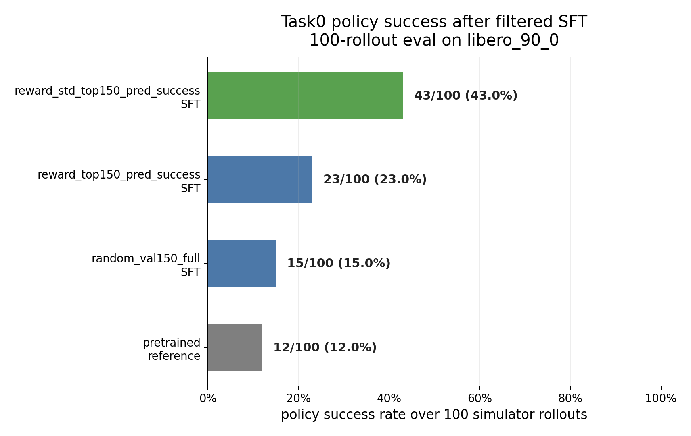

The ordering follows dataset quality more than dataset size in this run: the 8-episode reward+std dataset gives the strongest policy success rate despite being much smaller than the random 150-episode set. The result supports the success-like filtering direction, with the usual caveat that this is one task and one training seed.

## Rollout GIFs

Each block below shows three rollout GIFs for the corresponding policy/reference. GIFs are built from the observation image stream used by the policy.

### `pretrained_reference`

Episode 00: failure, 400 steps.

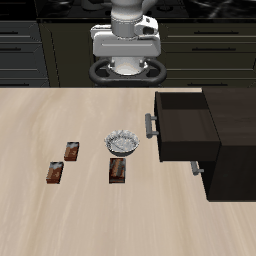

Episode 01: failure, 400 steps.

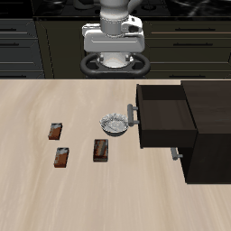

Episode 02: success, 125 steps.

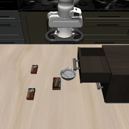

### `random_val150_full`

Episode 00: failure, 400 steps.

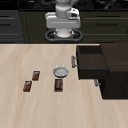

Episode 01: failure, 400 steps.

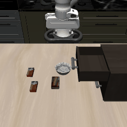

Episode 02: failure, 400 steps.

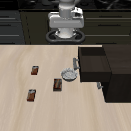

### `reward_top150_pred_success`

Episode 00: failure, 400 steps.


Episode 01: failure, 400 steps.

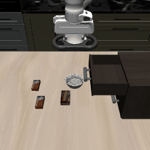

Episode 02: success, 183 steps.

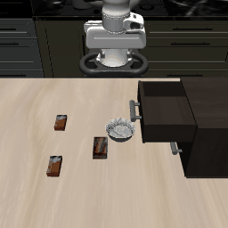

### `reward_std_top150_pred_success`

Episode 00: failure, 400 steps.

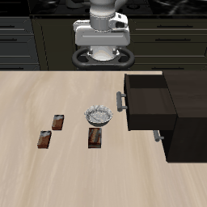

Episode 01: success, 385 steps.

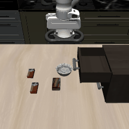

Episode 02: success, 111 steps.

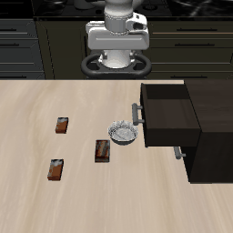

## Compact evidence

- Dataset CSV: [`dataset_success_failure_counts.csv`](assets/2026-07-02_task0_successlike_filtered_sft_report/dataset_success_failure_counts.csv)
- Policy success CSV: [`policy_success_rates.csv`](assets/2026-07-02_task0_successlike_filtered_sft_report/policy_success_rates.csv)
- GIF rollout CSV: [`rollout_gif_summary.csv`](assets/2026-07-02_task0_successlike_filtered_sft_report/rollout_gif_summary.csv)
- Summary JSON: [`summary.json`](assets/2026-07-02_task0_successlike_filtered_sft_report/summary.json)

## Reproducibility handles

- Run root: `/capstor/scratch/cscs/dsimoes/vla-post-training/preloaded_sft_task0_successlike_20260701_233851`
- Training/eval jobs: `2665011`, `2665013`, `2665014`, `2665015`
- Final GIF jobs: `2666821`, `2666822`, `2666823`, `2666824`
- Task: `libero_90_0`
- Eval rollouts: `100`
- SFT checkpoint step: `4000` final eval / checkpoint directory `4001`
