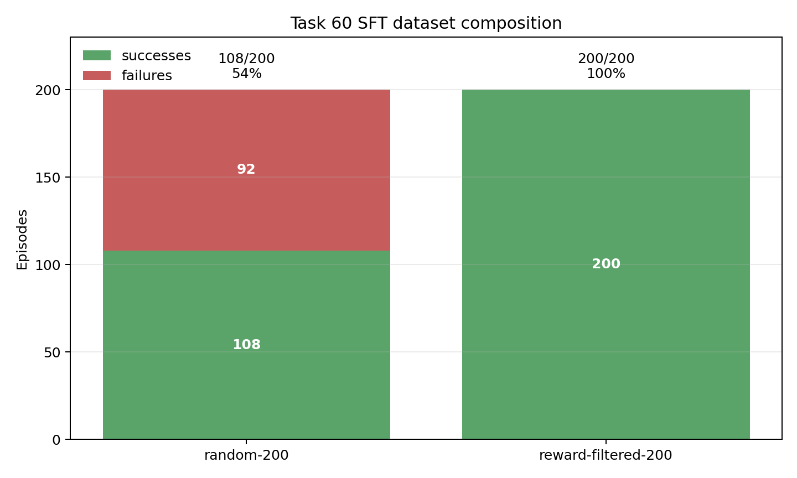
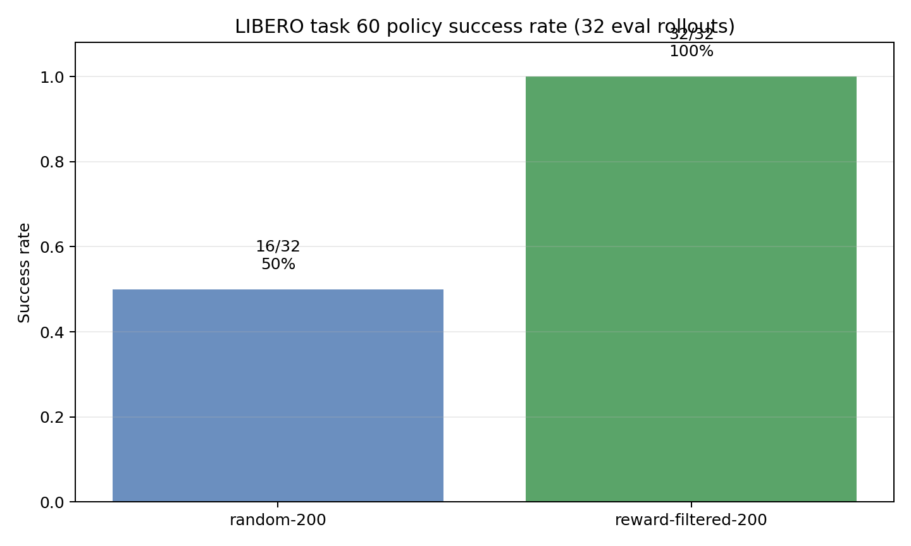

# 2026-07-02 Task 60 filtered SFT preliminary report

## Scope

This is a preliminary readout for LIBERO task 60 SFT from two preloaded 200-episode datasets:

- `random-200`: 200 episodes sampled randomly from the 600 available task-60 rollouts.
- `reward-filtered-200`: 200 episodes selected by the reward-filter score.

Training used only the provided dataset episodes. No new collection episodes were added during SFT. Policy success rates below are from the completed step-4001 checkpoint evaluation with 32 rollouts per policy. A 100-rollout evaluation is running and should supersede the eval table once complete.

## Quick readout

- The random dataset contains 108 successes and 92 failures out of 200 episodes (54.0% success-labeled).
- The reward-filtered dataset contains 200 successes and 0 failures out of 200 episodes (100.0% success-labeled).
- The random-200 SFT policy reached 16/32 successes, success rate 50.0%, on the completed 32-rollout eval.
- The reward-filtered-200 SFT policy reached 32/32 successes, success rate 100.0%, on the completed 32-rollout eval.

## Dataset composition

| Dataset | Episodes | Successes | Failures | Success-labeled share |
|---|---:|---:|---:|---:|
| random-200 | 200 | 108 | 92 | 54.0% |
| reward-filtered-200 | 200 | 200 | 0 | 100.0% |



## Policy evaluation success rate

Metric definition:

```text
success_rate = successful eval episodes / total eval episodes
```

Current completed evaluation uses 32 rollouts per policy on `libero_90_60` at checkpoint step 4001.

| Policy | Checkpoint step | Eval rollouts | Successes | Failures | Success rate | Mean successful episode length |
|---|---:|---:|---:|---:|---:|---:|
| random-200 SFT | 4001 | 32 | 16 | 16 | 50.0% | 118.75 |
| reward-filtered-200 SFT | 4001 | 32 | 32 | 0 | 100.0% | 131.19 |



## Pending 100-rollout confirmation

A 100-rollout eval was launched for the same step-4001 checkpoints. It is not included in the main table yet because it has not reached terminal state.

| Policy | Job ID | State at report write | Latest completed rollouts | Latest interim success rate |
|---|---:|---|---:|---:|
| random-200 SFT | 2664835 | running | 15/100 | 53.3% |
| reward-filtered-200 SFT | 2664836 | running | 30/100 | 100.0% |

## Interpretation

- Reward filtering removed all failure-labeled trajectories from the SFT set for this task: 200/200 selected episodes are labeled successes.
- The preliminary policy eval matches that direction: reward-filtered SFT is at 100% success on the 32-rollout evaluation, while random SFT is at 50%.
- Treat this as preliminary until the 100-rollout eval finishes; the random policy in particular has higher variance at 32 rollouts.
- Periodic eval support has been added for future runs, so success rate can be logged every `EVAL_INTERVAL` training steps instead of only at the final checkpoint.

## Compact evidence

- Dataset composition CSV: [`dataset_composition.csv`](assets/2026-07-02_task60_filtered_sft_preliminary/dataset_composition.csv)
- Policy eval CSV: [`policy_eval_32_rollouts.csv`](assets/2026-07-02_task60_filtered_sft_preliminary/policy_eval_32_rollouts.csv)
- Summary JSON: [`preliminary_summary.json`](assets/2026-07-02_task60_filtered_sft_preliminary/preliminary_summary.json)
